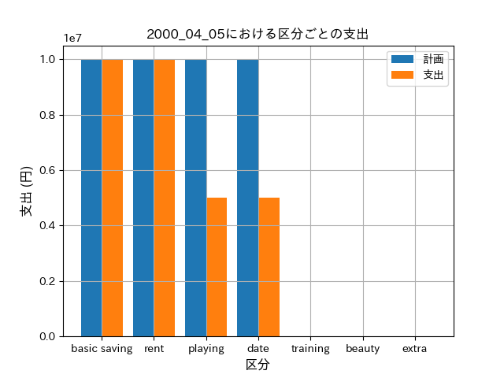

# 貯金管理プログラム

ほぼほぼ個人用のリポジトリです

Office （Excel）が無い ＆「収入とかを Google ドライブ上で管理するのは嫌だ」
と思ったので、適当にプログラム書いて管理することにしました

貯金は「定期貯金」と「追加貯金」に分けています。
追加貯金はおこづかい的な「手を付けていい」イメージで、定期貯金は人生設計上の貯金という「手を付けてはいけない」イメージです。

実はこのプログラム書いてから、[Moneytree](https://getmoneytree.com/jp/home)というアプリを見つけて、自分でも使ってます。
ただ、どっちにせよ、「貯金の区分」的なことはしてないはずなので、自分のコードも愛してやろうと思います。

## 環境

- OS: Ubuntu / Windows10 (Windows Subsystem for Linux)
- 言語: Python 3.8.4

## 必要ライブラリ

- pandas == 1.1.3
- matplotlib == 3.3.2
- japanize_matplotlib == 1.1.3

## 実行方法

1. `main.py`の 12 行目で設定している、給料日の日付を確認し、必要があれば変更する

   ```python
   self.PAYDAY = 25  # 給料日 書き換える
   ```

   月末が給料日なら、31 にする

2. 管理する期間（以下の場合、2000 年 4 月の給与日～ 5 月の給与日前日）のディレクトリを、`YYYY_MM_MM`をコピーすることで作成
   ```sh
   cp -r YYYY_MM_MM 2000_04_05
   ```
3. 1 で作ったディレクトリの `income.txt` , `additional_goal.txt` , `plan.csv` , `real_output.csv` に、それぞれ収入・目標追加貯金額・支出計画・実際の支出を記入する

   - `income.txt`

     ```
     10000000
     ```

   - `additional_goal.txt`

     ```
     100000000
     ```

   - `plan.csv`

     ```cs
     title,price,type
     定期貯金,10000000,basic saving
     家賃,10000000,rent
     キャバクラ,10000000,playing
     デート,10000000,date
     ```

     一行目("title,price,type")は必ず固定

     `title` に目的を記述し、 `price` にその金額、`type`に分類（`output_types.txt`に準拠）を記述する。

     定期貯金も、計画に含める

   - `real_output.csv`

     ```cs
     date,price,note,type
     20000420,10000000,定期貯金,basic saving
     20000501,10000000,家賃4月分,rent
     20000502,5000000,キャバクラ,playing
     20000503,5000000,デート,date
     ```

     `type`は`output_types.txt`に書いてあるものに統一する（必要に応じて、`output_types.txt`を書き換える）

     定期貯金も、支出に含める

4. `main.py` を実行

- 通常時

  ```sh
  python3 main.py -t 2000_04_05
  ```

- 決算時

  ```sh
  python3 main.py -t 2000_04_05 -s
  ```

  通常時は、計画分析ファイル（`plan_analyze_result.txt`）、項目別の支出棒グラフ（`output_by_type_bar.png`）を出力する。

  決算時は通常時に加えて、決算ファイル（`settlement.csv`）と次期間のディレクトリを出力する

  期間中の決算は出来ない（給料日が 20 日なら、2000/05/20 までは決算出来ない）

5. 実行結果

- 標準出力

  - 通常時

    ```
    ---------------------- 計画分析 --------------------------

    あなたは10,000,000 円(10%) を定期貯金します
    あなたは今期間に 60,000,000 円を追加で貯金します
    あなたの累積定期貯金額は 10,000,000円になる予定です。
    あなたの累計追加貯金額は 60,000,000 円になる予定です

    ----------------------- 支出分析 --------------------------

    あなたは今期間で既に30,000,000円使いました
    今月はあと70,000,000円使えます

    ----------------------- プログラム終了 --------------------------
    ```

  - 決算時

    ```
    ----------------------- 計画分析 --------------------------

    あなたは10,000,000 円(10%) を定期貯金します
    あなたは今期間に 60,000,000 円を追加で貯金します
    あなたの累積定期貯金額は 10,000,000 円になる予定です。
    あなたの累計追加貯金額は 60,000,000 円になる予定です

    ----------------------- 支出分析 --------------------------

    あなたは今期間で既に30,000,000円使いました
    今月はあと70,000,000円使えます

    ----------------------- 2000_04_05の決算 --------------------------

    あなたの累積追加貯金額は 70,000,000 円です

    ----------------------- プログラム終了 --------------------------
    ```

- 計画分析ファイル（`plan_analyze_result.txt`）

  ```
  あなたは10,000,000 円(10%) を定期貯金します
  あなたは今期間に 60,000,000 円を追加で貯金します
  あなたの累積定期貯金額は 10,000,000 円になる予定です。
  あなたの累計追加貯金額は 60,000,000 円になる予定です
  ```

- 棒グラフ（`output_by_type_bar.png`）
  

- 決算ファイル
  ```
  10000000,basic saving
  70000000,additional saving
  ```
